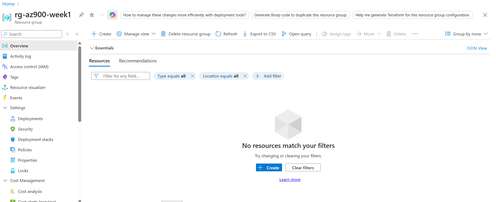

# Week 1 - Azure core (AZ-900)
## Day 1: Resource Group + Naming standards
### Why
Resource groups keep related resources together, it's like a folder. By using naming conventions and tags, I make my environment organised and easier to manage. 
- **Naming standards** help me know what a resource is, what project it belongs to, and its environment.
- **Tags** are key-value pairs used for cost management and automation.
- ### What I did
- Created a resource group: 'rg-az900-week1' in Canada East
- Applied tags: owener=estherlaura, projet=az900-week1, env=dev
- Documented my naming standard: type-projet-env-number
- ### screenshots

